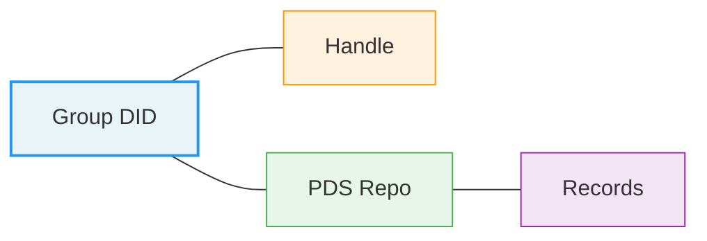
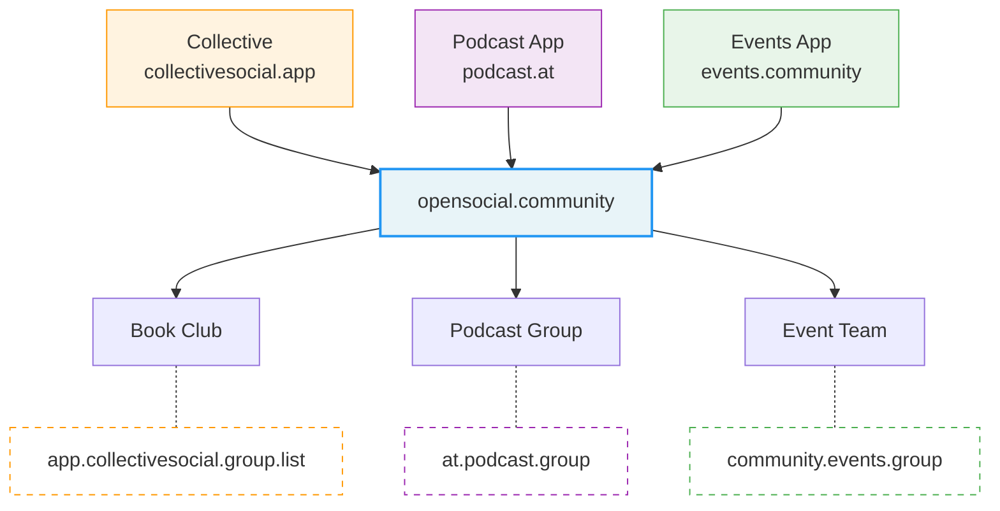
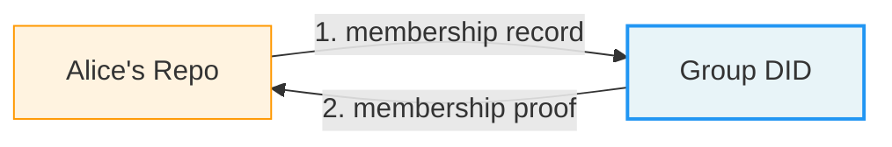
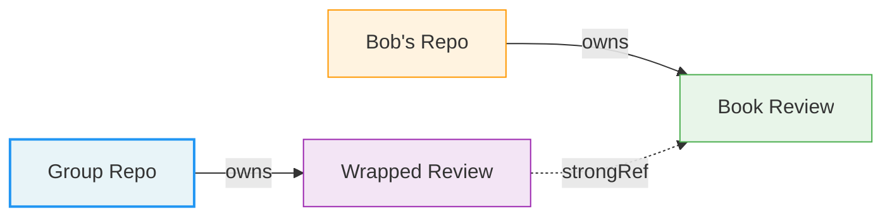

# Who Owns the Group Chat?

## Groups and Collective Ownership on ATProto

<div class="absolute bottom-10">
  <span class="font-700">
    @brittanyellich.com
  </span> | 
  <span class="font-400">
    Brittany Ellich
  </span>
</div>

<!--
- I'm Brittany
- Staff Eng at GitHub
- AtProto enthusiast
- Chronically online

- I co-host the Overcommitted podcast, will be recording this weekend
- I also brought stickers :)
-->

---

# A GoodReads on ATProto?

A few months ago I had what I thought was a brilliant idea: **why doesn't a GoodReads or Letterboxd exist on ATProto yet??**

<div class="relative mt-6">
  
  
</div>

<div v-click class="mt-4 p-3 bg-gray-100 rounded-lg text-sm text-center">

Turns out it did exist, and some folks did it way better than I did. (Please go check out popfeed.social!)

</div>

<!--
A few months ago I had what I thought was a brilliant idea. A GoodReads or Letterboxd on ATProto - how does this not exist yet?? So I started building Collective.

<click click>

Turns out it did exist. PopFeed and others were already doing this, and honestly doing it better than I did. But when I was researching what I wanted to build, one particular problem nerd-sniped me enough to look deeper into a particular pattern.
-->

---

# The Overcommitted Book Club


<div class="text-center mt-2 text-sm">

[overcommitted.dev](https://overcommitted.dev)

</div>

<!--
I run a book club for the online developer community for Overcommitted. We read technical and software books together, and it's one of my favorite places on the internet.
 
Right now we coordinate on Discord. And Discord is great! But Discord owns our member list, our reading history, and every conversation we've had about every book. If Discord decides to change their terms, or shut down, or ban us for some reason - all of that is just gone.
-->

---
layout: statement
---

## The platform owns your group


<!--
And this isn't a Discord problem specifically. It's a platform problem. Think about every group you're part of online - your subreddit, your Facebook group, your Slack workspace. In every case, the platform owns the space. Not you. Not your community.
-->

---
layout: statement
---

## The platform owns your group


<!--
And when the platform disappears, your community disappears with it. Google+, MySpace, Twitter, countless forums - all gone, along with every conversation, every shared memory, every piece of community knowledge. If Discord decides to shut down tomorrow, my book club's entire history vanishes. Not because we did anything wrong, but because we built in someone else's space.
-->

---

# ATProto Solved Personal Ownership

ATProto has been awesome for **personal data**:

- Your **posts** live in your repo
- Your **social graph** is under your control
- Your **identity** is portable to other PDSs

<div v-click class="mt-8 p-4 bg-gray-100 rounded-lg">

## But what about shared things?

What about the book club? The community project? The **group chat**?

That's a little less solved.

</div>

<!--
ATProto has done something really powerful for personal data. Your posts, your social graph, your identity - that lives in your repo, under your control. But what about shared things? What about the book club? The community project? The group chat?
 
That's still an open question. And it's an exciting one - because when you build groups on a decentralized protocol, you're forced to answer a question that centralized platforms never did: who actually owns this space?
-->

---

# Three Design Questions

Every group implementation must answer these:

<div class="mt-6 space-y-6">

## 1. Where does the group data live?

Someone's personal repo? A shared PDS? The AppView's storage? Each choice has tradeoffs for portability, performance, and ownership.

## 2. Who controls it?

The creator? A set of admins? The members collectively? The hosting service?

## 3. How do members relate to the group?

Do they store membership in their own repos? Is it a reference? A backlink? This determines whether users control their own group affiliations or whether the group controls them.

</div>

<!--
There are three questions you have to answer:
 
First: where does the group data live? On Reddit, it lives in Reddit's database. Simple. On ATProto, you have real choices. Does it go in someone's personal repo? On a shared PDS? In the AppView's own storage? Each choice has tradeoffs for portability, performance, and ownership.
 
Second: who controls it? The creator? A set of admins? The members collectively? The hosting service? On centralized platforms the answer is always "the platform, ultimately." Here, you get to be intentional.
 
Third: how do members relate to the group? Do they store membership in their own repos? Is it a reference? A backlink? This matters because it determines whether users control their own group affiliations or whether the group controls them.
-->

---

# Community Thinking

There's been wonderful thinking happening in this community already:

<div class="mt-6 space-y-4">

- **Bryan Newbold** - Proposals on group primitives and community spaces, including record scoping and self-hosting patterns
- **Nick Gerakines** - The "Community Manager Pattern" and wrapper records for forums
- **Meri** - Comprehensive summary of different approaches
- **Frontpage team** - GitHub discussion on groups architecture
- **Bonfire Networks / Erlend Sogge Heggen** - Group federation and groups-following-groups in the fediverse
- **Emelia (thisismissem.social)** - Guidance and consulting on developing a model

</div>

<div class="mt-8 p-4 bg-gray-100 rounded-lg text-sm">

I've been collecting all of these resources and learning from them to put together a solution (links at the end).

</div>

<!--
There's been wonderful thinking happening in this community already. Bryan Newbold has written two really thoughtful proposals - most recently on community spaces with self-hosting patterns. Nick Gerakines took some of these ideas and built out the "Community Manager Pattern," showing how wrapper records can separate data ownership from community curation. Meri put together a comprehensive summary. The Frontpage team has a great GitHub discussion. And Bonfire Networks and Erlend Sogge Heggen have been thinking and shared about group federation across the fediverse, including the really interesting idea of groups following groups. I've had some great input on Bluesky and on calls with Emelia on ways to think about this.
 
I've been collecting all of these resources and learning from them - I'll share links at the end.
-->

---
layout: quote
---

# ATProto's philosophy is 'your data, your repo.' That's great for personal data. But shared state doesn't fit neatly into one person's repo.

How do we extend the ownership model to collective data without losing what makes ATProto special?

<!--
ATProto's philosophy is "your data, your repo." That's great for personal data. But shared state, a reading list that belongs to a group, or a community description that multiple admins can edit, that doesn't fit neatly into one person's repo. So how do we extend the ownership model to collective data without losing what makes ATProto special?
-->

---
layout: section
---

# One Approach: opensocial.community

<!--
I want to walk you through one approach I've been building. This isn't the answer, it's an answer. But I think the best way to make progress on hard protocol questions is to build something concrete and learn from it.
-->

---

# opensocial.community

**Group infrastructure** a service that any ATProto app can use to add community features.

<div class="mt-4 text-sm text-gray-500">

This is not the answer, but it is an answer. The best way to make progress on hard protocol questions is to just build it and see how it works.

</div>

<div v-click class="mt-6 p-4 bg-gray-100 rounded-lg">

## Key design decisions

1. Groups as ATProto Identities (DIDs)
2. Separating Group Infrastructure from Apps
3. Membership as a Two-Way Handshake
4. The Wrapper Pattern for Shared Content

</div>

<!--
I created opensocial.community. it's group infrastructure, not an app. It's a service that any ATProto app can use to add community features. Let me walk through the main design decisions. <click>
-->

---

# Groups as DIDs

Every group has its own DID, making it a **first-class citizen** of the protocol.

```
did:web:overcommitted.dev
```



A group is not a row in some app's database. It's an entity with an identity, just like you and me.

<!--
Every group gets its own DID. So the Overcommitted book club is did:web:overcommitted.dev. It has its own handle, its own repo on a PDS, its own data store.
 
Why does this matter? Because it means a group is a first-class citizen of the protocol. It's not a row in some app's database. It's an entity with an identity, just like you and me. And just like personal DIDs, that identity is - at least in principle - portable.
 
Bryan Newbold also points out something cool here: that handle domain can serve double duty as the group's public website. So a PDS registering these dids could create a themed web view with OAuth login, giving the community a real home on the web with clean canonical URLs for its content.
-->

---

# Infrastructure vs. AppView

opensocial.community is **not** an AppView. It's infrastructure that AppViews **connect to**.



Each app gets its own **namespace**. Apps can only create, update, and delete records within their own namespace. **Same group, different data, no conflicts.**

<!--
opensocial.community is not an AppView. It's infrastructure that AppViews connect to. My app Collective, which is kind of like GoodReads for all types of media, uses opensocial.community for its groups. But a podcast app could use the same groups. A project management tool could use the same groups.
 
Each app gets its own namespace. Collective stores app.collectivesocial.group.list records, another app stores its own collection types. And critically, apps can only create, update, and delete records within their own namespace. Same group, different data, no conflicts, and no app can accidentally or maliciously mess with another app's data. The group is the shared context; the apps decide what to do with it.
-->

---

# Membership as a Two-Way Handshake

Membership is **bidirectional**. The user declares intent, and the group confirms it.



<div class="mt-4 space-y-3">

- Alice creates a membership record in **her repo**, she owns it
- The group creates a membership proof in **its repo** confirming acceptance
- Alice can leave anytime by deleting her record, no permission needed
- The group can revoke by removing the proof
- The group's repo stores CID hashes, not member identities directly

</div>

<!--
This is one I feel strongly about, and it's evolved from the original design thanks to Nick Gerakines' community manager pattern work.
 
When you join a group, that membership is a two-way handshake. First, you create a membership record in your own repo, which is your declaration of intent. Then the group creates a membership proof in its repo, confirming you.
 
This matters because without the confirmation step, anyone could claim to be a member of any group just by writing a record. The two-sided model gives both parties control: you can leave anytime by deleting your record, no permission needed. The group can revoke by removing the proof.
 
There's a nice privacy property too, if you look at the group's repo, you see a list of CID hashes, not member identities directly. You'd need to cross-reference with member repos to build the full membership list.
-->

---

# The Wrapper Pattern

User content stays in the user's repo. The group creates **lightweight wrappers** that reference it.



<div class="mt-4 space-y-2">

- Delete the wrapper, the user's content stays intact
- User leaves? Their content remains in their repo; wrappers become tombstones
- Multiple communities can wrap the same content
- The group repo is an index of references, not a copy of all content

</div>

<!--
This is one of the most elegant patterns to emerge from the community's thinking, and I want to give Nick Gerakines credit for articulating it so clearly.
 
The idea is: user content - a book review, a forum post, a discussion thread - stays in the user's repo. They own it. When that content should appear in a community context, the group creates a lightweight wrapper record in its own repo that references the original via a strongRef.
 
This separation of authorship from distribution is really powerful. If a moderator needs to remove something from the community, they delete the wrapper - but the user's original content stays in their repo. If a user leaves, their content is still theirs; the wrappers can become tombstones showing "content removed by author" while preserving the conversation structure. And multiple communities can create wrappers pointing to the same original content, enabling cross-posting without duplication.
 
This also means the group's repo stays lightweight - it's essentially an index of references, not a full copy of all community content. That has important implications for scale, which I'll come back to.
-->

---

# The Book Club, End to End

<div class="space-y-4">

**Step 1** - Register Collective as an AppView with opensocial.community, get an API key

<span class="text-sm text-gray-500">Service authentication via signed JWTs</span>

**Step 2** - Create the Overcommitted Book Club through Collective

<span class="text-sm text-gray-500">New community with its own DID and PDS-backed data store. Creator becomes first admin via membership handshake.</span>

**Step 3** - Members join through the two-way handshake

<span class="text-sm text-gray-500">Membership record in member's repo + membership proof in group's repo</span>

**Step 4** - Members contribute content via wrappers

<span class="text-sm text-gray-500">Book reviews live in member repos; Collective creates wrappers in the group repo under its namespace</span>

</div>

<div class="mt-4 p-3 bg-gray-100 rounded-lg text-sm">

The API supports community creation, membership management, namespaced record storage, audit logging, and custom roles and permissions.

</div>

<!--
Let me walk through what this looks like concretely.
 
I register Collective as an AppView with opensocial.community - that gives me service authentication via signed JWTs. When I create the Overcommitted Book Club through Collective, opensocial.community creates a new community with its own DID and PDS-backed data store. I'm added as the first admin through the membership handshake - my membership record in my repo, the proof in the group's repo.
 
Members join through the same two-way process. And when someone writes a book review, the content goes to their repo - they own it - and Collective creates a wrapper in the group's repo under its namespace. If another app wants to add different content to the same group, it creates records under its own namespace.
 
The API supports all of this: community creation, membership management, namespaced record storage, audit logging for accountability, and custom roles and permissions to give communities more control over how their community runs.
-->

---

# Register an App


<!--
First we register Collective as a developer app on opensocial.community. You get an app ID, API key, and you define which lexicon collections your app can read and write, with per-role permissions. Here Collective has permissions for group lists, list items, and post indices.
-->

---

# Community Members


<!--
Here's the Overcommitted community on opensocial.community. You can see the members, each identified by their ATProto handle. The community has its own DID, its own avatar, and settings that admins can manage. This is the group as a first-class identity on the protocol.
-->

---

# Community Settings


<!--
Community admins can configure settings like whether the community is open, approval-required, or invite-only, and how new apps interact with the community by default. These governance decisions are explicit and visible, not buried in some platform policy.
-->

---

# App Permissions


<!--
On the Apps tab, community admins control which apps can interact with their community. Each app can be enabled or disabled, and you can manage permissions per app. The community chooses what tools it wants, not the other way around.
-->

---


# Discover Communities


<!--
On the Collective side, users can browse and discover communities powered by OpenSocial. Each community has its own handle and membership status. You can see overcommitted.dev where I'm already a member, and other communities you can join or request access to.
-->

---

# The Book Club Community on Collective


<!--
Back on Collective, here's what the Overcommitted group looks like. The group has shared lists that any member can browse, created by Collective under its own namespace in the group's repo. We have a list of future book club options and our current reading list.
-->

---

# Reading Together


<!--
And here's what a book club reading looks like in practice. We're reading Writing for Developers by Piotr Sarna. The group has a shared reading schedule with chapter assignments and due dates, and each member tracks their own progress. The reading list and schedule live in the group's repo; the individual progress records live in each member's repo.
-->

---

# opensocial.community

Full app available at **opensocial.community**


<!--
Full app available at opensocial.community. It covers app registration with service authentication, community creation and management, the membership handshake with custom roles and permissions, namespaced record storage, a full audit log of every admin action, and webhooks so apps can react to changes in real-time.
-->

---

# collectivesocial.app

Alpha available at **collectivesocial.app**


<!--
Also you can check out collectivesocial at collectivesocial.app. It's full of lots of bugs and I'm not sure it will be used much beyond a test bed for open social and my little book club, but you can still go play around! 
-->

---
layout: section
---

# Governance and Moderation

<!--
So far I've been talking mostly about architecture. But the question in the title "who owns the group chat?" is really a governance question, and I think it's important to talk a bit about governance and moderation when we're talking about building group infrastructure.
-->

---

# Breaking Implicit Feudalism

Nathan Schneider coined the term **"implicit feudalism"** - the default pattern where whoever creates an online space has absolute power over it, usually governed by the rules of the platform.

<div class="grid grid-cols-2 gap-8 mt-6">

<div>

## The feudal default

"a bias, both cultural and technical, for building communities as fiefdoms."

- The platform controls the capabilities of the group
- The group admins have absolute power over the group
- A member needs to seek explicit permissions to make changes

</div>

<div>

## What shared groups on ATProto can enable

- **Shared ownership** - governance doesn't have to be locked to a single creator or platform
- **Transparent governance** - rules that are visible to everyone
- **Rules that fit your community** - we can just do things, let's make rules that actually work for communities

</div>

</div>

<!--
I want to name a concept here that I think is really important. Nathan Schneider, a media studies professor at CU Boulder, coined the term "implicit feudalism" to describe the default governance model of online communities. Whoever creates the space has essentially absolute power. Your only tools for dealing with conflict are censorship and exile. And the platform can override everything anyway.
 
We've all just accepted this as normal. But it's not inevitable - it's a design choice. 

ATProto gives us a chance to make different choices.
-->

---

# Moderation as a Community Choice

<div class="grid grid-cols-2 gap-8">

<div>

## Layered Moderation

Leaning on ATProto's **labeler system**, scoped to communities.

- The group DID itself can act as a labeler
- Admins approve labelers that align with community values
- Labelers can declare they only moderate within specific spaces
- Individual members can still add their own labelers on top

</div>

<div>

## The Wrapper Advantage for Moderation

The wrapper pattern enables **graduated moderation**:

- Remove a wrapper: content hidden from community, but the user's data is intact
- Remove a membership proof: revoke access without destroying contributions
- Deleted content leaves a tombstone preserving conversation structure
- Appeals: a future direction for disputing moderation decisions

</div>

</div>

<div class="mt-4 p-3 bg-gray-100 rounded-lg text-sm">

The community decides its moderation standards, not the platform.
</div>

<!--
For moderation, I'm planning to lean on ATProto's composable labeler system, but thinking about how it can be scoped specifically to community spaces.
 
Bryan Newbold proposed that the group DID itself could act as a labeler - which is elegant because it means the community's moderation is built into its identity. Admins can approve additional labelers that align with their values. And labelers can declare that they only moderate within specific spaces, which solves the overwhelming scope problem that labeler operators face on the broader network today.
 
The wrapper pattern also gives us really nice graduated moderation options. You can remove a wrapper to hide specific content without touching the user's data. You can remove a membership proof to revoke access. When content is deleted by the author, the wrapper stays as a tombstone preserving the conversation's structure. And there's room for appeals processes in the future.
 
Individual members can still stack their own labelers on top of the community defaults. So you get community-level standards AND personal customization.
 
The community decides its moderation standards, not the platform. That's empowering, but it also means the community is responsible for its moderation. There's a real tension there, and I don't think anyone has fully solved it yet.
-->

---

# There's still a lot to figure out

Things I'm still thinking about:

<div class="mt-6 space-y-6">

## Private groups

How can we create completely **private groups** and group membership? This can be critical for **community safety** - not every group should be publicly discoverable or have a visible member list.

## Group creation

Can we integrate a dedicated **group PDS** so that new group DIDs can be created easily from within an AppView - without requiring manual setup?

## Interop

Can we bridge ATProto groups to ActivityPub communities via **BridgyFed**?

## Governance models

How do we break implicit feudalism? How do we enable groups to run and operate without weird absolutist power dynamics?

</div>

<div class="mt-6 text-sm text-gray-500">

These are the kinds of problems that are best solved together, which is why I'm building in the open.

</div>

<!--
I want to be honest about what's not solved yet:

Private groups. How do we create completely private groups where membership isn't publicly visible? This matters a lot for safety - think support groups, vulnerable communities, internal teams. Right now ATProto repos are public by default, so we need to think carefully about privacy through indirection, encrypted membership lists, or other patterns.

Group creation. Right now creating a group means creating a new DID, which means PDS infrastructure. Can we integrate a dedicated group PDS so that AppViews can spin up new group DIDs seamlessly? The UX needs to be as simple as "create a group" in the app, not "go set up a PDS."

Interop. Can we bridge ATProto groups to ActivityPub communities via BridgyFed? Erlend Sogge Heggen has been thinking about group convergence across protocols, including the idea of groups following groups. Can we map existing Discord and Reddit concepts into this model? I think yes, but the mapping isn't trivial.

These are the kinds of problems that are best solved together, which is why I'm building in the open and why I'm sharing this with you today.
-->

---
layout: section
---

# Why are groups even important?

<!--
I want to zoom out for a moment. Because I've been talking about book clubs and APIs, but what we're really talking about is something much bigger.
-->

---

# What Becomes Possible

Groups are a **network-level primitive**. Every social app eventually needs them and every social app reinvents them.

<div class="mt-6 grid grid-cols-3 gap-6">

<div class="p-4 bg-gray-100 rounded-lg text-center">

## Collaborative Playlists

The playlist belongs to the **friend group**

</div>

<div class="p-4 bg-gray-100 rounded-lg text-center">

## Study Groups

Shared notes belong to the **students**

</div>

<div class="p-4 bg-gray-100 rounded-lg text-center">

## Discussion Forums

User content stays with **the author**; community curates with wrappers

</div>

</div>

<div class="mt-8 p-4 bg-gray-100 rounded-lg">

Decentralization isn't just about **personal** data sovereignty. It's about **collective** data sovereignty: a community's shared knowledge, history, and spaces should belong to the community.

</div>

<!--
Groups are a network-level primitive. Every social app eventually needs them - and every social app reinvents them from scratch. When you build groups as shared infrastructure on an open protocol, you're not just solving it for your app. You're solving it for every app on the network.
 
Think about what becomes possible: collaborative playlists where the playlist belongs to the friend group, not Spotify. Study groups where the shared notes belong to the students, not the university's LMS. Discussion forums - like the ones Nick Gerakines described - where user content stays with the author and the community curates it through wrappers.
 
And here's what I find most exciting about this: decentralization isn't just about personal data sovereignty. It's about collective data sovereignty: a community's shared knowledge, shared history, and shared spaces should belong to the community.
-->

---
layout: statement
---

# Who owns the group chat?

<h2 v-click>The group should</h2>

<!--
Who owns the group chat? The group should.
-->

---

# Let's build together

<div class="grid grid-cols-2 gap-8">

<div>

## Resources

- [opensocial.community](https://opensocial.community) - API and Docs
- [brittanyellich.com/atproto-groups](https://brittanyellich.com/atproto-groups) - Blog post
- [overcommitted.dev](https://overcommitted.dev) - The Overcommitted community and book club is open, come join us!

</div>

<div>

## Community References

- Bryan Newbold - [Community Spaces on AT Protocol](https://bnewbold.leaflet.pub/3me3ea64bhk26)
- Nick Gerakines - [The Community Manager Pattern](https://ngerakines.leaflet.pub/3majmrpjrd22b) and [Forums](https://ngerakines.leaflet.pub/3malqm3dqls27)
- [ATProto Community Discourse](https://discourse.atprotocol.community/t/representing-groups-and-other-shared-resources-in-atproto/296)
- Bonfire Networks - [Groups in the Fediverse](https://discourse.atprotocol.community/t/bonfire-networks-why-community-matters-groups-as-the-next-step-for-the-fediverse/350)
- Erlend Sogge Heggen - [Group Convergence](https://blog.erlend.sh/group-convergence)
- Nathan Schneider - [Governable Spaces](https://luminosoa.org/books/m/10.1525/luminos.181)

</div>

</div>

<!--
opensocial.community is live. The API is documented. I want you to build with it, or build something better.
 
If you're building an ATProto app and you need groups, come talk to me. I'd love to help you integrate, and I'd love to learn from what you need that I haven't thought of.
 
If you're thinking about governance models, moderation, or how communities should work on decentralized protocols - I want to hear your ideas. These are the kind of problems that get better when more people are thinking about them.
 
There's a list of community references here - Bryan Newbold's posts on community spaces, Nick Gerakines' community manager pattern work, the ATProto discourse discussion, Bonfire's thinking on groups for the fediverse, Erlend's group convergence post, and Nathan Schneider's Governable Spaces book on democratic design for online communities. These have all shaped my thinking and they're worth reading.
 
And if any of this sounds interesting and you also like reading books about software - the Overcommitted book club is open. Come join us.
-->

---
layout: intro
---

# Thank You

<div class="absolute bottom-10">
  <span class="font-700">
    Brittany Ellich
  </span>
  <br/>
  <span class="text-sm">
    opensocial.community | brittanyellich.com
  </span>
</div>

<!--
Thank you.
-->
